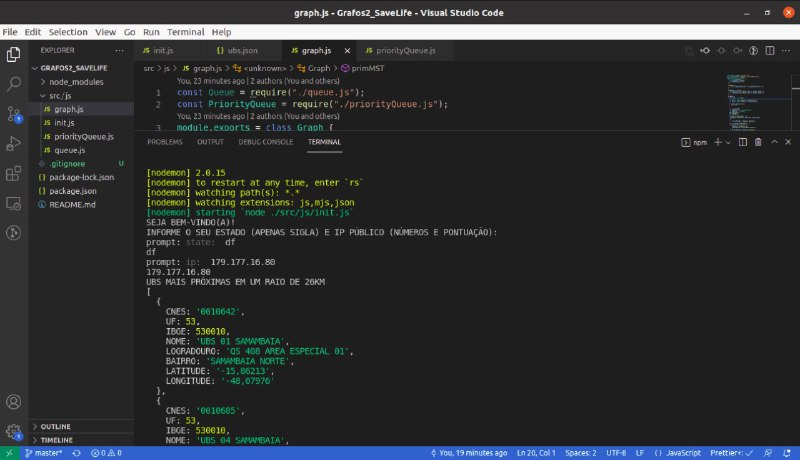
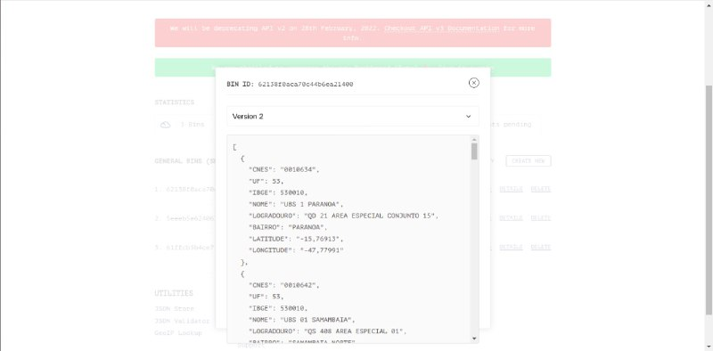
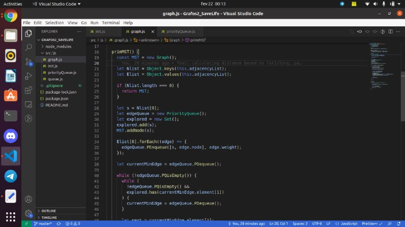

# Save Life

**Número da Lista**: 2<br>
**Conteúdo da Disciplina**: Grafos 2<br>

## Alunos
|Matrícula | Aluno |
| -- | -- |
| 18/0023411  |  Maicon Lucas Mares de Souza |
| 18/0018574  |  Hérya Rodrigues Alcantara |

## Sobre 
O Save Life é uma aplicação de linha de comando com objetivo de ajudar pessoas em situações de risco a encontrar Unidades Básicas de Saúde (UBS) mais próximas. Para tal, a aplicação utiliza árvores geradoras mínimas.

## Screenshots





## Instalação 
**Linguagem**: JavaScript<br>

* Pré-requisitos:
  * [Git](https://git-scm.com/)
  * [NodeJS](https://nodejs.org/en/)
  * [NPM](https://docs.npmjs.com/downloading-and-installing-node-js-and-npm)
  
 
 * Clonar o repositório
 
  * Instalar dependências
  ```bash
  npm install
  ```
  
 * Executar o projeto
  ```bash
  npm run start
  ```

## Uso
É necessário inserir **df** como state e, em seguida,  o IP do usuário.


